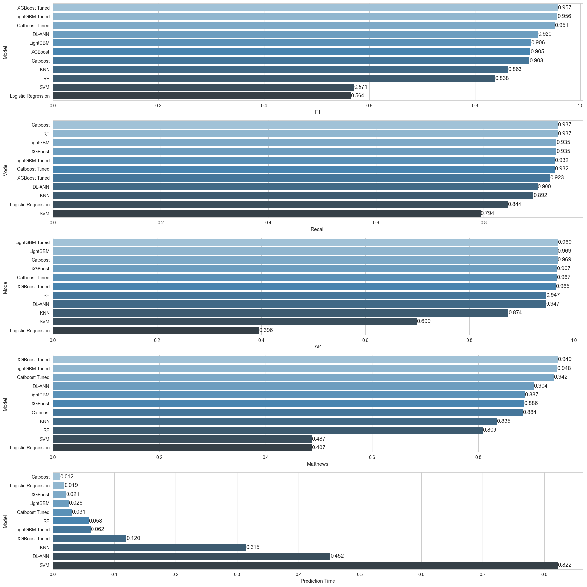

This project was developed by Selman Karaosmanoglu in collaboration with the Group 2 of the Data Science cohort of Clarusway Data Science School. 

Special thanks to all group members whose contributions have been invaluable to the project's success.

## Date created
07 July 2023

# Employee Churn Prediction Project
### Building a model to predict whether an employee is churned or not

## Overview
This project aims to build a predictive model using machine learning and deep learning algorithms to assess the risk of employees leaving a company, commonly referred to as 'employee churn'.

The project uses the Matthews Correlation Coefficient (MCC) as an evaluation metric for the binary classification model, particularly valuable in datasets with class imbalances. MCC offers a balanced measure of the model’s proficiency in predicting both churned and retained employees.

A range of models were evaluated for predicting employee churn:

- **Traditional Algorithms**: Logistic Regression, KNN, SVM, and Random Forest.
- **Boosting Algorithms**: Catboost, XGBoost, and LightGBM.
- **Deep Learning**: DL-ANN with TensorFlow.

The **Catboost** model was chosen for its excellent performance at the end. It demonstrated robust performance with the following metrics for class 1:
- **Precision**: 0.98
- **Recall**: 0.93
- **MCC**: 0.942

The model is deployed using Streamlit for easy access and interaction.

Once predicted, Streamlit sends the relevant data to the OpenAI API for churn analysis. The resulting analysis report can be conveniently downloaded in PDF format.

## Dataset
- `HR_Dataset.csv`: The main dataset used for the project.

## Notebooks
- `Churn Prediction_Student_Notebook_V3.ipynb`: Jupyter notebook containing the exploratory data analysis, preprocessing, and model building for churn prediction.

## Models
- `emp_churn_final_model`: The final model used for predicting employee churn.
- `scaler_churn`: Scaler file.
- `transformer_churn`: Transformer file.

## Analysis Reports
- `employee_churn_2023-06-19_00-29-16.pdf`
- `employee_churn_2023-06-19_00-31-32.pdf`: PDF reports of the analysis

## Requirements

Language: Python 3.9

Libraries: numpy, pandas, matplotlib, seaborn, plotly, cufflinks, termcolor, scikit-learn, xgboost, lightgbm, yellowbrick, streamlit, pickle, openai, docx, scipy, reportlab

## Usage
Install the required dependencies using the command `pip install -r requirements.txt`

Run the command `streamlit run app.py` to launch the Streamlit web application.

## Contributing
Contributions to this project are welcome. Please open an issue or submit a pull request for any enhancements.

## License
This project is licensed under the MIT License - see the LICENSE file for details.
